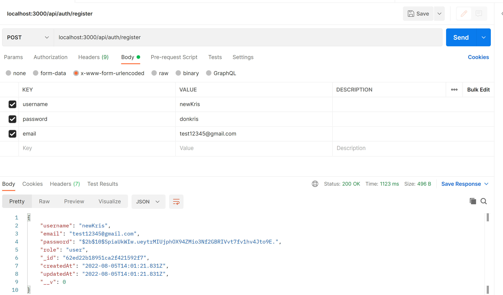
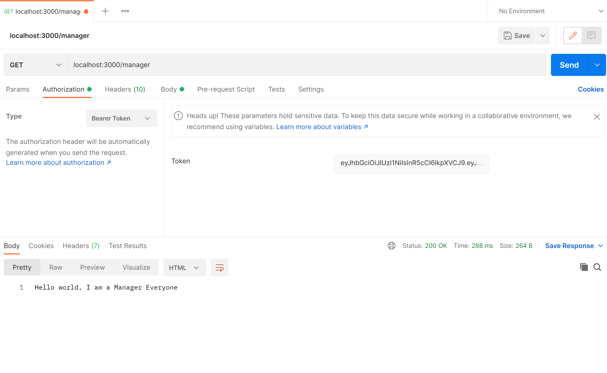

# AuthSystem

# How to run the app

`nnodemon server` will start the app on localhost:3000

# about the app

This app provides RESTFUL api endpoints that can be used to authenticate and authorize users. The app contains 4 different user roles - admin, manager, staff and user. Each route is handled based on the role that is set for the user. Additionally, other routes are protected based on predefined user roles.

# what you will see

When you register a user, it returns the user's information

Route - `localhost:3000/api/auth/register`

When a user logs in, it returns the auth token and additional user information

Route - `localhost:3000/api/auth/login`

Users, Staff, Managers and Admin can visit their routes after verifying they have tokens and Role matches their respective routes. 

User Route - `localhost:3000/user`

Staff Route - `localhost:3000/staff`

Manager Route - `localhost:3000/manager`

Admin Route - `localhost:3000/admin`

A User with a different Role cannot access the Route of a User with another Role.
For instance a Manager cannot access the Admin Route as seen below.

Users can reset their passwords by inputing their registered email address.
They get a link directly to their email with reset password link.

Route - `localhost:3000/api/auth/resetpassword`

After enetering new password, the password is reset sucessfully

